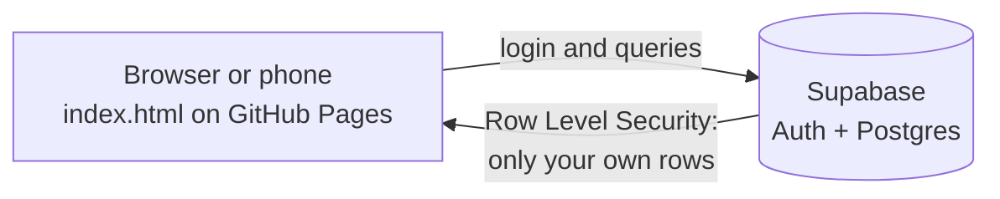

<h1 align="center">Market Tracker</h1>

<p align="center">
  A market and shopping list tracker with quantities, prices and discounts.<br>
  Log in once and your list follows you from your phone to your computer.
</p>

<p align="center">
  <a href="https://shawonthesu.github.io/Market_Tracker/"><b>Open the live app</b></a>
</p>

<p align="center">
  
  
  
  
</p>

---

## Screenshots

### Desktop

<p align="center">
  
</p>
<p align="center">
  
</p>

### Mobile

<p align="center">
  
  &nbsp;&nbsp;
  
</p>

## Try it on your phone

<p align="center">
  <br>
  <sub>Scan to open the app</sub>
</p>

## Features

| | |
|---|---|
| **Items** | Add, edit and delete items with a name, details, quantity, unit and unit price. Tick items off as bought. |
| **Discounts** | A percentage or fixed ₹ amount on any item, plus a discount on the whole bill. |
| **Totals** | Live subtotal, savings and final total, with Indian digit grouping (₹1,00,000.00). |
| **Accounts** | Email sign up and login. Each person sees only their own list. |
| **Cloud sync** | The list is stored in a database, so every device shows the same items. |
| **Safe to use** | Undo after a delete or a clear, and checks for empty names, zero quantities, negative prices and oversized discounts. |
| **Mobile friendly** | Large touch targets and a bottom bar that always shows the total. |

## How the total is worked out

1. Line total = quantity × unit price
2. Item discount = a percentage or fixed amount, never more than the line total
3. Subtotal = the sum of all line totals after item discounts
4. Bill discount = a percentage or fixed amount, never more than the subtotal
5. **Total = subtotal − bill discount**

## How it works



The web app is a single static file with no build step. It talks to Supabase directly from the browser. Access control is done in the database with Row Level Security, so a logged-in user can only read and change their own rows.

## Tech stack

| Part | Technology |
|---|---|
| Web app | HTML, CSS and vanilla JavaScript in one file |
| Database and login | [Supabase](https://supabase.com) (Postgres, Auth, Row Level Security) |
| Hosting | GitHub Pages |
| Desktop app | Python 3 with Tkinter, standard library only |
| Look | Crumpled paper background, dark brown text, [Doto](https://fonts.google.com/specimen/Doto) font |

## Run your own copy

1. **Create a Supabase project** at [supabase.com](https://supabase.com).
2. **Create the tables.** Open the SQL Editor and run:

<details>
<summary>Show the SQL</summary>

```sql
create table public.items (
  id uuid primary key default gen_random_uuid(),
  user_id uuid not null default auth.uid() references auth.users(id) on delete cascade,
  name text not null,
  details text not null default '',
  qty numeric not null check (qty > 0),
  unit text not null default 'pcs',
  price numeric not null check (price >= 0),
  discount_type text not null default 'pct' check (discount_type in ('pct','fix')),
  discount_value numeric not null default 0 check (discount_value >= 0),
  bought boolean not null default false,
  created_at timestamptz not null default now()
);

create table public.bill_settings (
  user_id uuid primary key default auth.uid() references auth.users(id) on delete cascade,
  discount_type text not null default 'pct' check (discount_type in ('pct','fix')),
  discount_value numeric not null default 0 check (discount_value >= 0)
);

alter table public.items enable row level security;
alter table public.bill_settings enable row level security;

create policy "own items" on public.items for all to authenticated
  using (user_id = (select auth.uid())) with check (user_id = (select auth.uid()));
create policy "own bill settings" on public.bill_settings for all to authenticated
  using (user_id = (select auth.uid())) with check (user_id = (select auth.uid()));

grant select, insert, update, delete on public.items to authenticated;
grant select, insert, update, delete on public.bill_settings to authenticated;
```

</details>

3. **Set up login.** In Supabase, enable the Email provider, then set **Authentication → URL Configuration → Site URL** to the address where you host the page.
4. **Add your keys.** In `index.html`, replace the two constants at the top of the script with your **Project URL** and **publishable key** (Supabase → Settings → API Keys):

   ```js
   const SB_URL = 'https://YOUR-PROJECT.supabase.co';
   const SB_KEY = 'sb_publishable_...';
   ```

5. **Host it.** Push the repo to GitHub and turn on **Settings → Pages** (deploy from `main`, root folder).

> **Keys:** only the publishable key belongs in the page. Never put the secret key or the `service_role` key in this repo.

## Python desktop app

A standalone desktop version with the same look. It saves your list locally to `~/.market_tracker.json` and does not use the cloud database.

```bash
python3 market_tracker.py
```

It needs Python 3 with Tkinter. If Tkinter is missing, the script tries to install it with your system package manager. On Fedora you can also run `sudo dnf install python3-tkinter`.

**Doto font (optional):** Tkinter only uses installed fonts, so without it the app falls back to a monospace font. To install Doto:

```bash
mkdir -p ~/.local/share/fonts
cp Doto-*.ttf ~/.local/share/fonts/
fc-cache -f
```

## Project structure

```
Market_Tracker/
├── index.html             # Web app (HTML, CSS, JavaScript, Supabase)
├── market_tracker.py      # Python desktop app (Tkinter)
├── assets/
│   └── qr-code.png        # QR code for the live app
└── README.md
```

## Roadmap

- [x] Web app with discounts and totals
- [x] Mobile layout
- [x] Accounts and cloud sync with Supabase
- [ ] Sync the Python desktop app with the same database
- [ ] Work offline and sync when the connection returns
- [ ] Categories, search and export
